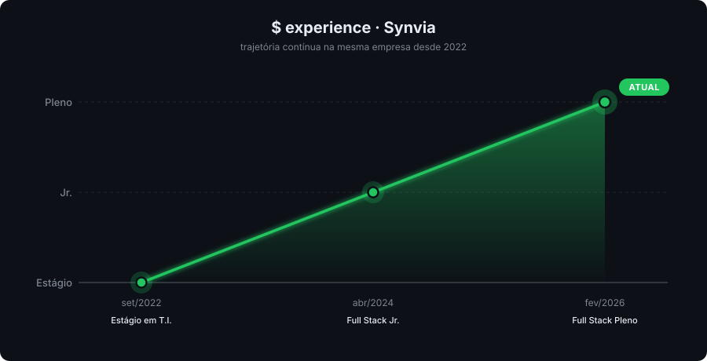

Formado em **Análise e Desenvolvimento de Sistemas** pela UNICAMP, atuando como desenvolvedor full stack desde 2022. Hoje na Synvia, trabalho em sistemas multi-tenant de captura eletrônica de dados clínicos (eCRF), com foco em backend NestJS, frontend Next.js, modelagem de dados versionados em PostgreSQL/Drizzle e integração de IA no fluxo de desenvolvimento (Spec-Driven Development).

<br/>

[](https://www.linkedin.com/in/gabriel-santos-20b4b8197)
[](https://github.com/G182500)

<br/>

## `skills`

```
TypeScript        ████████████████████░░░░   85%   Principal linguagem
NestJS            ████████████████████░░░░   80%   Backend
Next.js / React   ███████████████░░░░░░░░░   75%   Frontend
PostgreSQL        ███████████████░░░░░░░░░   70%   Drizzle + multi-schema
Drizzle ORM       ███████████████░░░░░░░░░   70%   Schema, migrations, queries
Git / CI/CD       ██████████████░░░░░░░░░░   70%   Versionamento + GitHub Actions
Jest / Playwright ██████████████░░░░░░░░░░   65%   Unit + E2E BDD
Docker            ██████████░░░░░░░░░░░░░░   50%   Containers de dev
Angular           █████████░░░░░░░░░░░░░░░   45%   Estudo (x-men-frontend)
```

<br/>

## `stack`

<table>
  <tr>
    <td align="right" width="140"><b>Languages</b></td>
    <td>
      
      
      
      
    </td>
  </tr>
  <tr>
    <td align="right"><b>Frontend</b></td>
    <td>
      
      
      
      
      
    </td>
  </tr>
  <tr>
    <td align="right"><b>Backend</b></td>
    <td>
      
      
      
    </td>
  </tr>
  <tr>
    <td align="right"><b>Database</b></td>
    <td>
      
      
      
    </td>
  </tr>
  <tr>
    <td align="right"><b>Quality</b></td>
    <td>
      
      
      
      
      
    </td>
  </tr>
  <tr>
    <td align="right"><b>DevOps</b></td>
    <td>
      
      
      
      
      
    </td>
  </tr>
  <tr>
    <td align="right"><b>AI</b></td>
    <td>
      
      
    </td>
  </tr>
</table>

<br/>

## `$ experience`

> Trajetória contínua na **Synvia** desde 2022 — estágio → Jr. → Pleno, sem trocar de empresa.

<p align="center">
  
</p>

<br/>

## `$ education`

<table>
  <tr>
    <td valign="top" align="center" width="220">
      
    </td>
    <td valign="middle">
      <h3>Análise e Desenvolvimento de Sistemas</h3>
      
    </td>
  </tr>
  <tr>
    <td valign="top" align="center" width="220">
      
    </td>
    <td valign="middle">
      <h3>Tecnólogo em T.I.</h3>
      
    </td>
  </tr>
</table>

<br/>

## `$ courses`

<table>
  <tr>
    <td valign="top" align="center" width="220">
      
    </td>
    <td valign="middle">
      <h3>Masterclass I.A.</h3>
      
      
    </td>
  </tr>
  <tr>
    <td valign="top" align="center" width="220">
      
    </td>
    <td valign="middle">
      <h3>Curso de Python</h3>
      
      
    </td>
  </tr>
</table>

<br/>

## `$ projects`

### eCRF — Plataforma de Pesquisa Clínica

> Sistema multi-tenant para captura eletrônica de dados de estudos clínicos (formulários, visitas, randomização, dispensação, queries e relatórios), substituindo o fluxo tradicional em papel.

<table>
  <tr>
    <td align="right"><b>Backend</b></td>
    <td>NestJS · Drizzle ORM · PostgreSQL multi-schema · Zod</td>
  </tr>
  <tr>
    <td align="right"><b>Frontend</b></td>
    <td>Next.js · React · TanStack Query · React Hook Form · Tailwind</td>
  </tr>
  <tr>
    <td align="right"><b>Quality</b></td>
    <td>TypeScript strict · Jest · Playwright (E2E + BDD)</td>
  </tr>
  <tr>
    <td align="right"><b>Infra</b></td>
    <td>Docker · Turborepo · pnpm workspaces · GitHub Actions</td>
  </tr>
</table>

**Contribuição em destaque — Versionamento de estudo.** Estudos clínicos ficam meses (às vezes anos) em coleta, mas formulários, visitas e regras precisam continuar editáveis mesmo depois que participantes começaram a responder. Projetei e implementei o modelo de versionamento que permite editar a estrutura do estudo sem invalidar dados já coletados:

- **Histórico íntegro** — cada participante continua respondendo na versão à qual foi alocado, mesmo quando uma nova versão é publicada.
- **Edição segura em produção** — o pesquisador edita formulários, visitas e regras em um rascunho da próxima versão, sem afetar a coleta em andamento.
- **Configurações que valem para todas as versões** — alertas automáticos, regras de randomização, dispensação e relatórios continuam funcionando corretamente em qualquer versão do estudo.
- **Mudanças complexas com integridade preservada** — ao editar um item, suas dependências (campos, condições, listas de opções) são propagadas automaticamente para o rascunho.
- **Padronização de respostas no longo prazo** — opções publicadas em listas de seleção ficam imutáveis (com possibilidade de desativar, em vez de remover), garantindo que respostas antigas continuem válidas.

<br/>

## `$ workflow`

Uso IA como parte central do meu desenvolvimento, com foco em **Spec-Driven Development (SDD)** — especificar o problema antes de escrever código:

- **Especificação antes do código** — descrevo modelo, regras invariantes e casos de borda em uma spec viva (Markdown) antes da implementação. A IA ajuda a refinar a spec, encontrar contradições e usá-la como contrato em revisões. O versionamento de estudos do eCRF nasceu desse fluxo.
- **Memória persistente entre sessões** — sistema de memória local que guarda decisões, feedback e contexto de projeto, evitando re-explicar tudo a cada conversa.
- **Pipeline de testes assistida** — uso agentes para explorar a issue, gerar cenários BDD em `.feature`, gerar testes E2E em Playwright e iterar até passarem.
- **Revisão multi-agente** — PRs passam por revisão automática com agentes especialistas (NestJS, React, segurança) antes da revisão humana.
- **Planejamento e brainstorming** — IA como parceiro de design, explorando trade-offs e validando premissas antes de tocar código.

> A diferença não é "IA escreve o código" — é usar IA para descrever o problema com clareza suficiente para que a implementação flua sem ambiguidade.

